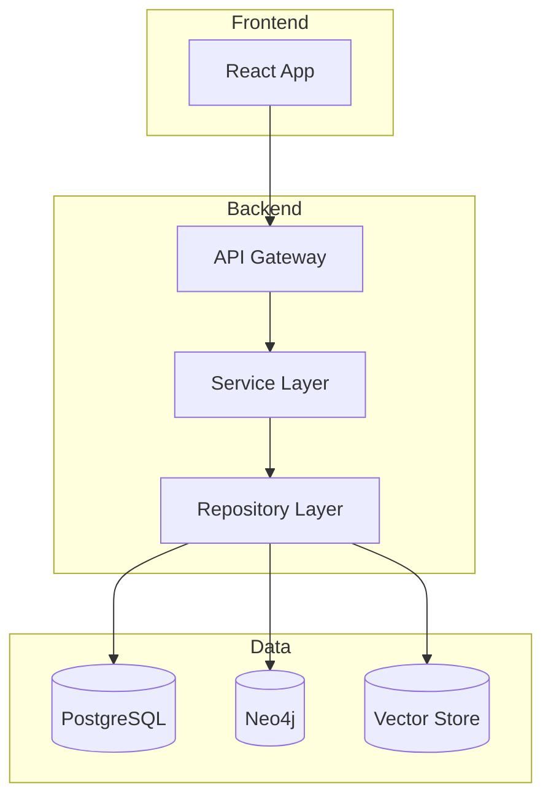
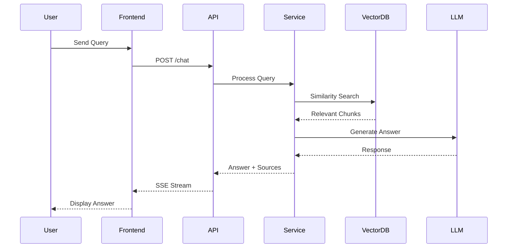

# Architecture Blueprint Generator

**Analyze codebases and generate comprehensive architectural documentation.**

## Overview

This skill automatically detects technology stacks and architectural patterns, generates visual diagrams, documents implementation patterns, and provides extensible blueprints for maintaining architectural consistency.

## Capabilities

1. **Stack Detection** — Identify languages, frameworks, databases, and tools
2. **Pattern Recognition** — Detect architectural patterns (MVC, microservices, event-driven, etc.)
3. **Component Mapping** — Map files to architectural components
4. **Diagram Generation** — Create Mermaid diagrams for system architecture
5. **API Documentation** — Document endpoints, request/response formats
6. **Dependency Analysis** — Map internal and external dependencies

## Blueprint Structure

### 1. System Overview

```markdown
## System Overview
- **Name**: [Project Name]
- **Type**: [Monolith / Microservices / Serverless / Hybrid]
- **Primary Language**: [Go / Python / TypeScript / etc.]
- **Architecture Pattern**: [Clean Architecture / Hexagonal / MVC / etc.]
- **Key Technologies**: [List frameworks, DBs, tools]
```

### 2. Component Diagram (Mermaid)



### 3. Data Flow Diagram



### 4. Directory Structure Analysis

Map each top-level directory to its architectural role:
- `cmd/` → Entry points
- `internal/` → Business logic (not exported)
- `pkg/` → Shared libraries (exported)
- `api/` → API definitions
- `migrations/` → Database schema evolution
- `frontend/` → UI layer

### 5. Technology Decision Records

Document why specific technologies were chosen:

| Decision | Choice | Alternatives Considered | Rationale |
|----------|--------|------------------------|-----------|
| Database | PostgreSQL | MySQL, SQLite | JSON support, pgvector |
| Graph DB | Neo4j | ArangoDB, Neptune | Cypher, community, GDS |
| Frontend | React | Vue, Svelte | Ecosystem, team skills |
| API Framework | Gin | Echo, Fiber | Performance, middleware |

## Usage

When asked to analyze architecture:

1. **Scan** the project structure (files, directories, configs)
2. **Detect** the tech stack from package files, imports, configs
3. **Map** components to architectural layers
4. **Generate** Mermaid diagrams for visual representation
5. **Document** patterns, decisions, and data flows
6. **Identify** potential architectural improvements

## Source

Based on [github/awesome-copilot architecture-blueprint-generator](https://github.com/github/awesome-copilot/tree/main/skills/architecture-blueprint-generator)
